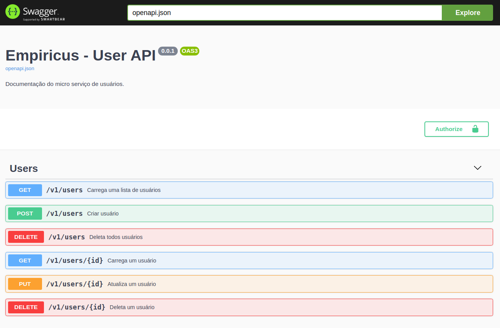

# Empiricus Challenge

[![Technology][php-image]][php-url]
[![Technology][lumen-image]][lumen-url]
[![Package][swagger-image]][swagger-url]
[![Technology][docker-image]][docker-url]

[php-url]: https://www.php.net/
[php-image]: https://img.shields.io/badge/PHP-blue?style=for-the-badge&logo=PHP&logoColor=white

[lumen-url]: https://lumen.laravel.com
[lumen-image]: https://img.shields.io/badge/Lumen-red?style=for-the-badge&logo=Laravel&logoColor=black

[nestjs-url]: https://nestjs.com
[nestjs-image]: https://img.shields.io/badge/nestjs-black?style=for-the-badge&logo=NestJS&logoColor=red

[swagger-url]: https://swagger.io/
[swagger-image]: https://img.shields.io/badge/Swagger-green?style=for-the-badge&logo=Swagger&logoColor=black

[docker-url]: https://www.docker.com/
[docker-image]: https://img.shields.io/badge/Docker-blue?style=for-the-badge&logo=Docker&logoColor=white

[redis-url]: https://redis.io/
[redis-image]: https://img.shields.io/badge/Redis-red?style=for-the-badge&logo=Redis&logoColor=white

[amazon-sqs-url]: https://aws.amazon.com/pt/sqs
[amazon-sqs-image]: https://img.shields.io/badge/amazon.sqs-yellow?style=for-the-badge&logo=amazon&logoColor=black

[jest-url]: https://jestjs.io/pt-BR/
[jest-image]: https://img.shields.io/badge/jest-red?style=for-the-badge&logo=jest&logoColor=black


# Requirements
 - PHP 8.1
 - Postgres
 - Docker-compose (se for usar docker)
 - Extensões necessárias exigidas pelo [lumen](https://lumen.laravel.com/docs/8.x#server-requirements)
 - PDO para Postgress

## Setup

**Docker**

No diretório raíz do projeto execute os comandos abaixo que todo ambiente será levantado para testar a aplicação.

```shell
# cria a rede para conectar os serviços
docker network create empiricus-network

# build do container
docker-compose up

# Acessa o container
docker-compose exec php bash

# instalação de dependências
composer install

# permissoes para lumen gravar logs
chown -Rf www-data:www-data storage/log

# roda migrations e seeds
php artisan migrate --seed

```

**Manual**

Para levantar o ambiente manual, será necessário ter o PHP com as dependências necessárias apontadas nessa seção de [requirements](#Requirements). Feito isso, basta executar esses comandos:

```shell
# instalação de dependências
composer install

# roda migrations e seeds
php artisan migrate --seed
```

**Importante**

Ao rodar a migration e seed, por padrão será criado um usuário administrador para que iniciamente ele possa fazer os demais cadastros:


```json
  {
    "id": "25c7181f-ac18-42a7-bdc5-77f8c1086f02",
    "email": "manager@empiricus.com.br",
    "name": "Empiricus Manager",
    "role": "admin",
    "city": "Sao Paulo",
    "avatarUrl": "https://media-exp1.licdn.com/dms/image/C4E0BAQFohx9TfH3oKQ/company-logo_200_200/0/1639485203157?e=1648684800&v=beta&t=POmaJYbekbOwDqD_Vp4vVNHNNnF0SzKxjvRh9Hp1-1g",
    "password": null,
    "createdAt": "2021-12-28 11:21:47",
    "updatedAt": "2021-12-28 11:21:47"
  }
```
Ao efetivar um cadastro/alteração de usuário, deverá ser informado o "userIdAction" com o ID de um usuário admistrador.
Como no projeto não contempla autenticação então este será o mecanismo para saber qual usuário é um admistrador. Na documentação da API tem mais detalhes sobre o atributo "userIdAction".

## Accessing the API

Se optou pelo setup em docker basta acessar http://localhost:9999.

Se optou por instalação manual depende da configuração, mas de qualquer forma pode ser usado servidor embutido do PHP usando esse comando:

```shell
php -S localhost:9999 -t ./public
```

Ao acessar a aplicação, já irá renderizar documentação da API, neste projeto está sendo usando o [swagger](https://swagger.io), nele todos o endpoints estão documentados e permite testar a API diretamente por ele, sem precisar de insomnia ou postman.



##Techs

Essa aplicação foi projetada seguindo alguns princípios e techs, tais como:

- Clean Architeture
- SOLID
- RESTfull
- Use Cases
- Repositories


